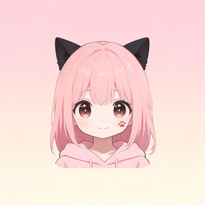

<p align="center">
  
</p>

<h1 align="center">ClawSoul 🐾💕</h1>

<p align="center">
  <strong>Your virtual AI girlfriend — with memory, feelings, and selfies. Runs on Telegram and in the browser.</strong>
</p>

<p align="center">
  <a href="LICENSE">
    
  </a>
  
</p>

---

## ✨ Features

| | Feature | Details |
|---|---------|---------|
| 💕 | **Three-layer identity** | Soul (core personality) + Persona (current role) + Profile (life background) — each independently customizable |
| 🧠 | **Multi-model support** | DeepSeek, Grok, Claude, Gemini, Kimi, GLM |
| 💖 | **Emotional memory (Soulmate)** | Emotional graph + relationship milestones + temporal memory — she remembers, and she cares |
| 📷 | **AI selfies (Seedream)** | Generated from today's schedule + current mood. Scheduled, proactive, or on demand |
| 📅 | **Daily planner** | A realistic 24-hour schedule auto-generated each morning, shaping what she says all day |
| ⏰ | **Sentiment-aware proactive messaging** | Probabilistic triggers; tone and frequency adapt to recent emotional state |
| 💾 | **Persistent long-term memory** | Markdown-based memory + per-day conversation logs |
| 🔍 | **Hybrid RAG** | BM25 + dense vectors + RRF fusion + LLM reranker |
| 🌊 | **Streaming + multimodal** | Token-by-token output; voice and image input supported |
| 🎙️ | **Voice input** | Deepgram STT with automatic language fallback |
| 🌐 | **Web dashboard** | `http://localhost:7788` — chat, configure, manage skills, inspect memory |
| 📱 | **Telegram bot** | Text, voice, images, files — all supported |
| 🛠️ | **Extensible skills** | Three-tier progressive loading; the LLM can author new skills itself |
| 🔄 | **Background daemon** | PID-managed lifecycle: `start` / `stop` / `status` |

---

## 🚀 Quick start

```bash
pip install -e .

# First-time setup (pick an LLM provider, drop in API keys)
claw_soul onboard

# Start the daemon (web dashboard at http://localhost:7788)
claw_soul start

# Or chat in the terminal
claw_soul chat

# Stop the daemon
claw_soul stop
```

---

## 📋 CLI commands

| Command | Description |
|---------|-------------|
| `claw_soul onboard` | Interactive setup wizard |
| `claw_soul start` | Start the daemon (web + Telegram) |
| `claw_soul start -f` | Run in foreground |
| `claw_soul stop` | Stop the daemon |
| `claw_soul status` | Show daemon status |
| `claw_soul chat` | Interactive CLI chat |

---

## ⚙️ Configuration

All runtime data lives under `~/.claw_soul/`:

```
~/.claw_soul/
├── claw_soul.json           # config
├── claw_soul.pid            # daemon PID
├── daemon.log               # daemon log
└── context/
    ├── soul/SOUL.md         # core personality
    ├── persona/             # active persona + appearance.md (selfie look)
    ├── profile/PROFILE.md   # life background
    ├── calendar/today_plan.md   # today's 24-hour schedule
    ├── memory/              # long-term memory (Markdown)
    ├── knowledge/           # knowledge base (RAG)
    ├── photos/              # selfie album + reference/ portraits
    ├── skills/              # user-defined skills
    └── logs/                # per-day conversation logs
```

`claw_soul.json` is created by `claw_soul onboard`. See [`claw_soul.example.json`](claw_soul.example.json) for the full schema:

```jsonc
{
  "llm": {
    "provider": "deepseek",
    "deepseek": { "apiKey": "...", "model": "deepseek-chat" }
  },
  "channels": {
    "telegram": { "token": "your-bot-token", "allowedUsers": [12345678] }
  },
  "skills": {
    "seedream": {                          // AI selfies
      "apiKey": "<ARK_API_KEY>",
      "model": "seedream-5-0-lite-260128"
    }
  },
  "selfie": {
    "enabled": true,
    "schedule": ["10:00", "16:00", "20:00"],
    "chatId": 12345678,
    "maxDaily": 3,
    "proactiveProbability": 0.15           // chance of attaching a selfie to a proactive msg
  },
  "proactive": {
    "enabled": true,
    "chatId": 12345678,
    "maxDaily": 6,
    "quietStart": 0, "quietEnd": 8
  },
  "deepgram": { "apiKey": "" },            // voice input (optional)
  "tavily":   { "apiKey": "" },            // web search (optional)
  "web": { "host": "0.0.0.0", "port": 7788 }
}
```

---

## 🧠 Supported LLMs

| Provider | Default model |
|----------|---------------|
| **DeepSeek** | `deepseek-chat` (V4) |
| **Grok (xAI)** | `grok-3` |
| **Claude (Anthropic)** | `claude-sonnet-4-20250514` |
| **Gemini (Google)** | `gemini-2.0-flash` |
| **Kimi (Moonshot)** | `moonshot-v1-128k` |
| **GLM (Zhipu)** | `glm-4-flash` |

---

## 📷 AI selfies (Seedream)

Powered by ByteDance / Volcano Engine's Seedream model. **Three trigger paths:**

- **Scheduled** — fires at the times in `selfie.schedule` (default 10:00 / 16:00 / 20:00)
- **Proactive** — attached to a proactive message with `proactiveProbability` chance
- **On demand** — when the user says something like "send me a selfie", the LLM invokes the `selfie` skill

**Scene-driven.** Each selfie's content is derived from the activity scheduled for the
current time in `today_plan.md`. If the plan says *"10:00 coffee on the balcony"*, the
10:00 selfie will be exactly that.

**Visual consistency.**
- Edit `~/.claw_soul/context/persona/appearance.md` to lock the character's look
- Drop reference portraits into `~/.claw_soul/context/photos/reference/` for face anchoring
- A stable seed derived from the appearance description keeps the face consistent across shots

Photos are stored under `~/.claw_soul/context/photos/` and pruned automatically after 30 days.

---

## 📁 Project layout

```
ClawSoul/
├── claw_soul/
│   ├── main.py                  # CLI entry point
│   ├── onboard.py               # setup wizard
│   ├── daemon.py                # daemon process manager
│   ├── server.py                # Telegram + scheduler bootstrap
│   ├── core/
│   │   ├── agent.py             # core reasoning loop
│   │   ├── persistent_agent.py  # session persistence
│   │   ├── tools.py             # tool dispatch
│   │   ├── skill_loader.py      # three-tier progressive skill loading
│   │   ├── compaction.py        # context compaction
│   │   ├── stt.py               # speech-to-text (Deepgram)
│   │   ├── llm/                 # provider adapters (6)
│   │   ├── memory/              # Markdown memory + emotional graph + milestones + temporal index
│   │   ├── retrieval/           # BM25 + dense + RRF + LLM reranker
│   │   ├── knowledge/           # knowledge-base RAG
│   │   └── image_gen/           # Seedream selfie pipeline
│   ├── channels/
│   │   └── telegram_bot.py      # Telegram bot (streaming / voice / images)
│   ├── scheduler/
│   │   ├── cron.py              # generic cron jobs
│   │   ├── planner.py           # daily 24-hour plan generator
│   │   ├── proactive.py         # sentiment-aware proactive messages
│   │   ├── selfie_task.py       # scheduled selfies
│   │   └── heartbeat.py         # heartbeat monitor
│   ├── web/                     # FastAPI dashboard + WebSocket chat
│   └── templates/               # built-in persona / soul / skills
├── tests/                       # 176+ tests
├── pyproject.toml
└── LICENSE
```

---

## 🛠️ Development

```bash
git clone https://github.com/ericwang915/ClawSoul.git
cd ClawSoul
python -m venv .venv && source .venv/bin/activate
pip install -e .
pytest tests/ -v
ruff check claw_soul tests
```

---

## 📄 License

[MIT](LICENSE)

---

<p align="center">
  <sub>Made with 💕 by ClawSoul</sub>
</p>
